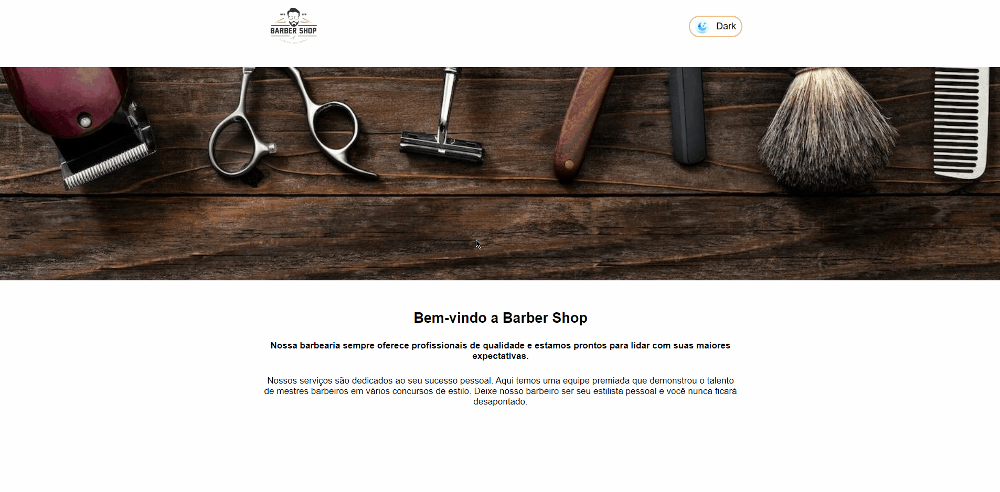

<h1>Projeto Barbearia - ReactJS</h1>

## Sobre
<p>Aplicação construída em React JS de uma barbearia com as propriedades 'useState' e 'onClick' para criar a versão Dark mode e Light mode do site.</p>

## Tecnologias 
- HTML
- CSS
- Javascript
- React Js

## Página principal
<h1>
    
</h1>


## Pré-requisitos
Antes de começar, você vai precisar ter instalado em sua máquina as seguintes ferramentas:
[Git](https://git-scm.com), [Node.js](https://nodejs.org/en/).


### Rodando o projeto

```bash
# Clone o repositório
$ git clone <https://github.com/andrehferrari/Dark-Mode.git>

# Acesse a pasta do repositório no terminal/cmd
$ cd Dark-Mode

# Instale as dependências
$ npm i -y

# Execute a aplicação em mode de desenvolvimento
$ npm start
```

Made with love by André Ferrari